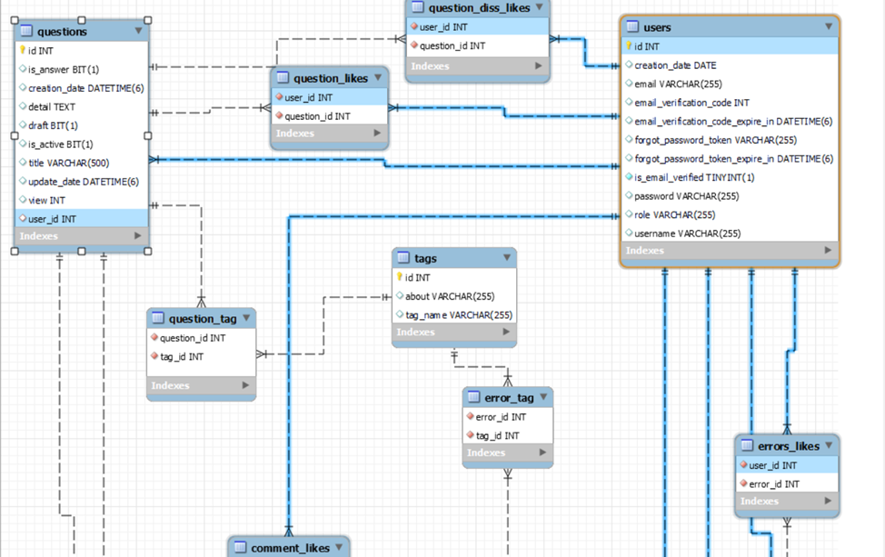
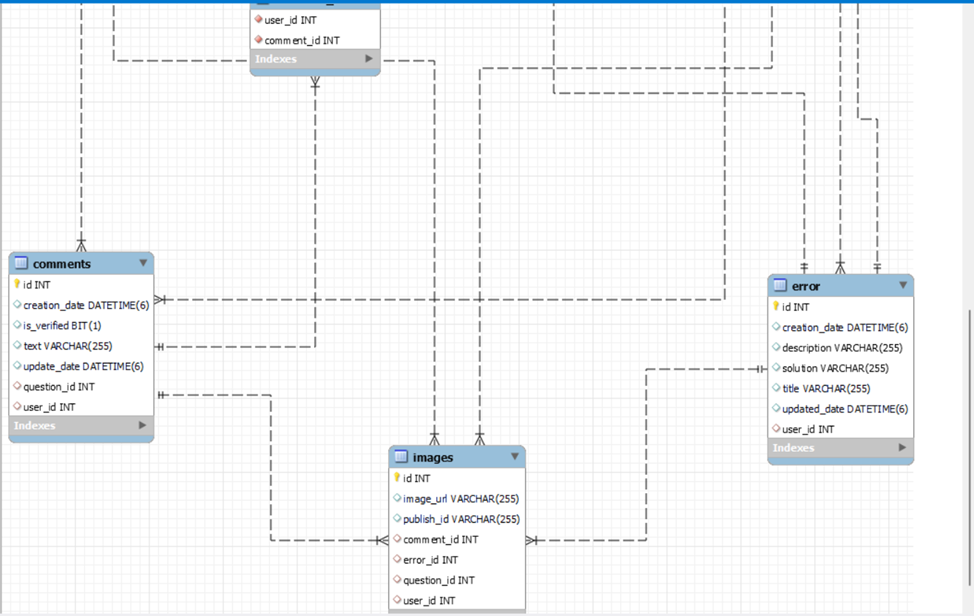

## Service To Share and Answer Programming Questions

---

#### `StackError-API`
* Users will be able to share the questions he does not understand and will be able to see the questions in others.
* Users will be able to write comments.
* Users will be able to write the errors they encounter.
* Users will be able to like and dislike comments , questions and errors. 

---

## How does the application works?

---

The user looks at the questions asked and written errors without entering the site. At the same time, he can read the flight comments to these questions without logging in. You can register and login from the user site. If you do not remember the registration information, you can update the email links. After logging in, he can ask questions, write working errors, and write comments on given questions (errors are not commented on). Can like or dislike questions, errors, comments.

---

## Database Architecture

---




---

##  AWS Elastic Beanstalk Deploy URL and Documentation

---

AWS EB Base URL :
http://stackerrorsapi-env.eba-ftyp2wsy.us-east-1.elasticbeanstalk.com/

Postman : 
https://documenter.getpostman.com/view/21835802/2s93CGRG1A

---

## Technologies

---
- Java 8
- Spring Boot 2.5.3
- AWS S3 Bucket
- Cloudinary
- Spring Security
- Mail Sender 
- Docker
- Docker Compose 
- Open API Documentation
- Spring Data JPA
- Validation 
- Postgresql
- Lombok 
- Restful API
- Maven
- Junit5
- Mockito
- Integration Tests
- Github Actions


## Prerequisites

---
Maven or Docker

---

## Docker Run
The application can be built and run by the `Docker` engine. The `Dockerfile` has multistage build, so you do not need to build and run separately.

Please follow the below directions in order to build and run the application with Docker Compose;

```sh
$ cd stackerrors-backend
$ docker-compose up -d
```


---
## Maven Run
To build and run the application with `Maven`, please follow the directions below;

```sh
$ cd stackerrors-backend
$ mvn clean install
$ mvn spring-boot:run
```
